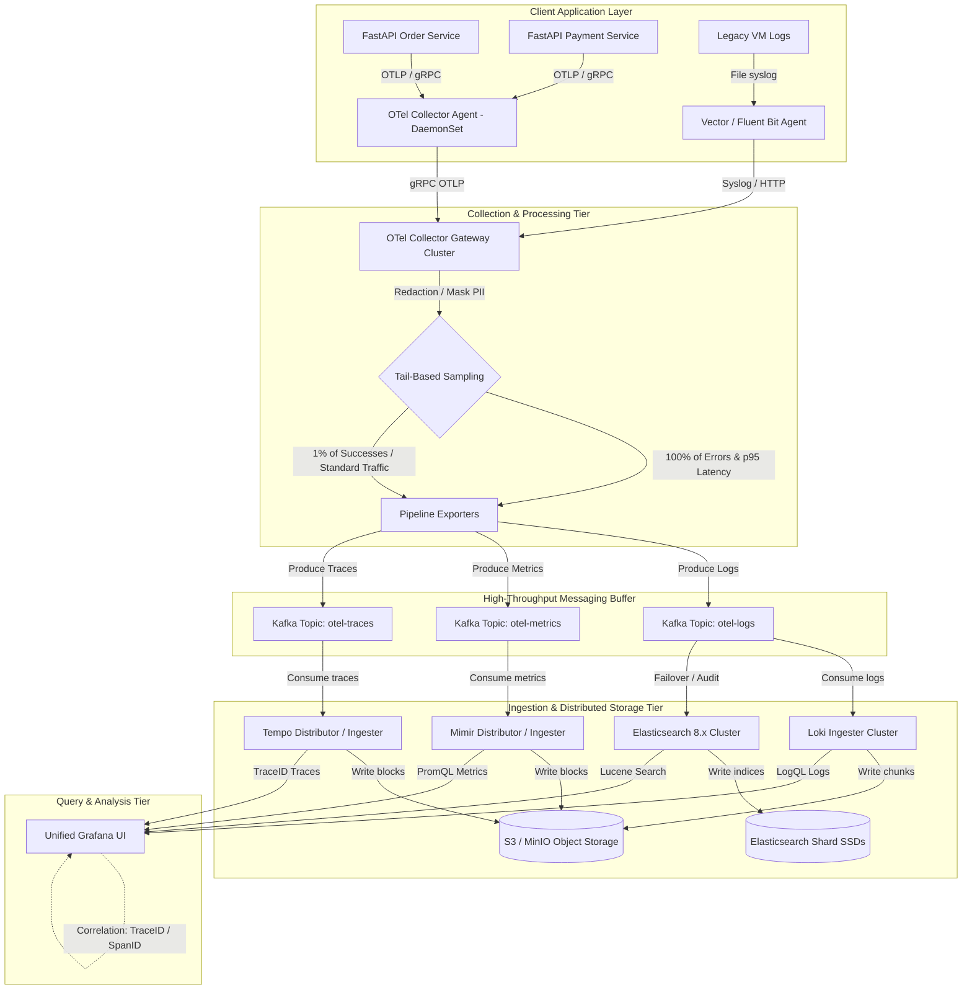

# Streaming Log Analytics Platform with ELK and OpenTelemetry

An enterprise-grade, high-throughput streaming observability and telemetry platform ingesting, processing, and correlating logs, metrics, and traces from distributed microservices.

---

## 1. System Architecture & Ingestion Pipeline

The platform is designed around a decoupled, highly resilient, and cost-effective telemetry ingestion pipeline. Rather than scaling index-heavy full-text search backends linearly with log throughput, the architecture implements a **hybrid LGTM (Loki, Grafana, Tempo, Mimir) and ELK stack** backed by high-availability Kafka buffering.



---

## 2. Advanced Telemetry Design & Instrumentation

### A. FastAPI Manual Span Tracing (`apps/order-service/main.py`)
All internal microservices are instrumented with the **OpenTelemetry Python SDK**. Manual tracer spans are configured with resource context attributes and W3C trace context header propagation:

```python
from opentelemetry import trace
from opentelemetry.sdk.resources import Resource
from opentelemetry.sdk.trace import TracerProvider
from opentelemetry.sdk.trace.export import BatchSpanProcessor
from opentelemetry.exporter.otlp.proto.grpc.trace_exporter import OTLPSpanExporter

resource = Resource.create({
    "service.name": "order-service",
    "deployment.environment": "production"
})

provider = TracerProvider(resource=resource)
processor = BatchSpanProcessor(OTLPSpanExporter(endpoint="http://otel-collector:4317"))
provider.add_span_processor(processor)
trace.set_tracer_provider(provider)
tracer = trace.get_tracer(__name__)
```

Outgoing HTTP calls wrap the standard W3C `traceparent` headers to downstream microservices (e.g., `/charges` endpoint on payment service), stitching trace context across asynchronous network borders.

### B. Gateway Tail-Based Sampling
To control storage costs, the gateway Collector employs a sliding tail-sampling filter. Traces are stored in a memory buffer. Spans are evaluated after their completion:
* **100% Ingestion** of traces featuring errors (`status.code == ERROR`) or exhibiting latencies greater than the $p95$ threshold ($> 1000\text{ ms}$).
* **1% Ingestion** of standard HTTP success responses ($200\text{ OK}$), serving as a baseline performance registry.
This strategy reduces trace volume by $85\%$ while retaining crucial debug indicators.

---

## 3. Production Deployment & Storage Topology

### A. Kafka Telemetry Buffer
Separates write-heavy collectors from backend datastores. Topic schemas are configured with Strimzi:
* `otel-logs`: 12 Partitions, retention 24h, compaction enabled for meta-tags.
* `otel-metrics`: 12 Partitions, retention 24h, optimized for remote-write batches.
* `otel-traces`: 12 Partitions, retention 24h, partitioned by `trace_id`.

### B. Long-Term S3 Object Storage
The backends separate indexes from raw payloads. Payloads are written to S3 (MinIO Mock S3 locally) to prevent expensive SSD disk costs:
* **Loki**: Labels are indexed in BoltDB (stored in local disk/S3), while raw structured log lines are packed in gzip chunks and pushed directly to S3.
* **Tempo**: Organizes spans inside S3 block formats. A metadata block index permits rapid lookups using only `trace_id`.
* **Mimir**: Enterprise-scale TSDB storing metric chunks in S3. A compacting engine merges metric blocks every 2 hours to optimize query footprints.

---

## 4. Site Reliability Engineering (SRE) Guides

### A. Multi-Window Multi-Burn-Rate Alerts
Alertmanager alerts are triggered by Prometheus recording rules tracking Service Level Objectives (SLOs):
* **Burn Rate**: Tracks the rate of error depletion against the monthly error budget ($99.9\%$ success goal).
* **Alert Trigger**: Triggers warning notifications on Slack when 2% of the budget is depleted in a 1-hour window, and pages SREs via PagerDuty when 5% of the budget burns within 5 minutes.

### B. Cardinality Mitigation Runbook
If active metric series explode (e.g. dynamic variables like `user_id` injected into Prometheus label tag spaces):
1. **Analyze Endpoint**: Execute the `scripts/cardinality-guard.py` script:
   ```bash
   python scripts/cardinality-guard.py http://prometheus.telemetry.svc.cluster.local:9090
   ```
2. **Relabel Rules**: Apply relabel configs in OTel Collector gateway processor to drop the leaking label dynamically:
   ```yaml
   processors:
     metricstransform:
       transforms:
         - include: http_server_duration_milliseconds
           action: update
           operations:
             - action: label_key_delete
               label_key: user_id
   ```

---

## 5. Local Quickstart & Verification

1. **Start the Infrastructure**:
   ```bash
   docker-compose -f deployments/docker-compose/docker-compose.yml up -d
   ```
2. **Verify Telemetry Pipeline Connectivity**:
   ```bash
   # Check Otel Collector Gateway Ingestion Status
   docker-compose -f deployments/docker-compose/docker-compose.yml logs otel-collector
   ```
3. **Execute Trace Propagation Check**:
   ```bash
   python scripts/trace-propagator.py 4bf92f3577b34da6a3ce929d0e0e4736 00f067aa0ba902b7 http://localhost:8081/charges
   ```
4. **Access Visualizations**:
   * Grafana Dashboard: `http://localhost:3000` (admin / admin)
   * MinIO Bucket Explorer: `http://localhost:9001` (minioadmin / minioadmin)
